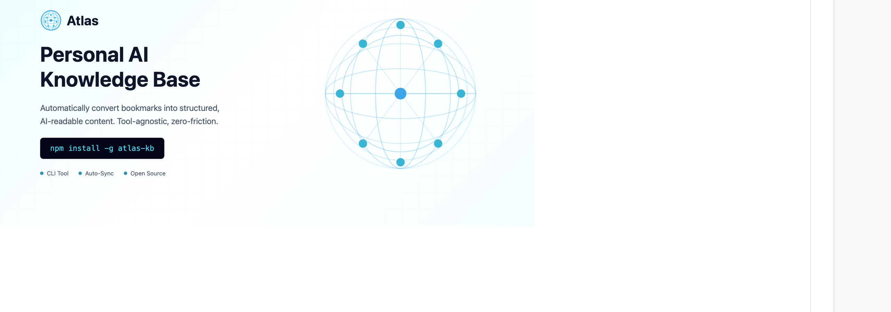

<p align="center">
  
</p>

<p align="center">
  <strong>Turn any URL or bookmark into AI knowledge — automatically synced to your coding tools.</strong>
</p>

<p align="center">
  <a href="https://www.npmjs.com/package/atlas-ai"></a>
  <a href="https://nodejs.org"></a>
  <a href="LICENSE"></a>
</p>

---

Atlas captures URLs — blog posts, docs, Reddit threads, Twitter/X threads — classifies them as **skills** or **knowledge notes** using AI, and symlinks them directly into your coding tools (Claude Code, Cursor, Copilot, Windsurf) so they're always available in context.

## Features

- **One command capture** — `atlas capture <url>` does everything: fetch, classify, generate, sync
- **Multi-tool sync** — Claude Code, Cursor, GitHub Copilot, Windsurf supported out of the box
- **Smart extraction** — Twitter threads, Reddit posts, `llms.txt`, `llms-full.txt`, and general HTML
- **AI classification** — auto-detects skill vs knowledge; override with `--as skill|knowledge`
- **Zero lock-in** — entries stored as plain markdown in `~/.ai-knowledge`; symlinked, never copied
- **Pluggable AI** — uses Claude CLI → OpenCode CLI → Anthropic SDK, whichever you have
- **Offline-friendly** — 24h content cache, `--dry-run` preview, manual `--as` flag

## Quick Start

```bash
# Install
npm install -g atlas-ai

# Run the setup wizard
atlas init

# Capture your first URL
atlas capture https://react.dev/learn/hooks-overview

# List everything you've captured
atlas list
```

## Installation

**Requirements:** Node.js 18+

```bash
npm install -g atlas-ai
```

Atlas needs at least one AI provider to classify captures. It will auto-detect from:

| Provider | How to set up |
|---|---|
| Claude CLI | `npm install -g @anthropic-ai/claude-code` |
| OpenCode CLI | `npm install -g opencode-ai` |
| Anthropic SDK | `export ANTHROPIC_API_KEY=sk-...` |

## Usage

### `atlas init`

Interactive setup wizard. Run this first.

```
atlas init
```

Walks you through:
1. **Browser** — which bookmark folder to watch (Chrome, Brave, Arc, Edge, or skip)
2. **Coding tools** — which tools to sync to (auto-detects installed ones)
3. **AI provider** — which LLM to use for classification

### `atlas capture <url>`

Capture a URL as a skill or knowledge note.

```bash
atlas capture https://example.com/blog-post

# Force the type
atlas capture https://example.com --as skill
atlas capture https://example.com --as knowledge

# Override the generated title/slug
atlas capture https://example.com --name "My Custom Title"

# Add extra tags
atlas capture https://example.com --tags "react,hooks,patterns"

# Preview without saving
atlas capture https://example.com --dry-run
```

**Supported sources:**
- Twitter / X threads (via fxtwitter — no auth needed)
- Reddit posts and comment threads
- Sites with `llms-full.txt` or `llms.txt`
- Any web page (HTML fallback via cheerio)

### `atlas list`

List all captured entries.

```bash
atlas list

# Filter by type
atlas list --type skill
atlas list --type knowledge

# Filter by tag
atlas list --tag react

# Limit results
atlas list --limit 10
```

### `atlas show <slug>`

Display the full content of an entry.

```bash
atlas show react-hooks-overview
```

### `atlas search <query>`

Search entries by title, tags, or URL.

```bash
atlas search "event loop"
atlas search typescript
```

### `atlas delete <slug>`

Delete an entry and remove it from all provider symlinks.

```bash
atlas delete react-hooks-overview

# Skip confirmation
atlas delete react-hooks-overview --force
```

### `atlas providers`

Manage provider integrations.

```bash
# Show detection and health status
atlas providers status

# Re-sync all entries to all detected providers
atlas providers sync
```

### `atlas daemon`

Manage the background bookmark watcher. When running, Atlas automatically captures any URL you add to the configured bookmark folder in your browser.

```bash
# Start the background watcher
atlas daemon start

# Stop the background watcher
atlas daemon stop

# Show status (running, PID, last heartbeat)
atlas daemon status
```

**How it works:** After running `atlas init` with a browser selected, `atlas daemon start` spawns a background process that watches your browser's bookmark file. When you add a URL to the "Atlas" folder (configurable in `~/.ai-knowledge/config.json`), it's automatically captured — same pipeline as `atlas capture <url>`.

Daemon output is logged to `~/.ai-knowledge/.daemon.log`.

## How It Works

```
atlas capture <url>
       │
       ▼
  Extract content           Twitter → fxtwitter API
  (ExtractorRegistry)       Reddit  → .json trick
                            llms-full.txt / llms.txt
                            HTML    → cheerio fallback
       │
       ▼
  Classify with AI          skill: actionable how-to, tutorial, pattern
  (ClassificationResponse)  knowledge: concept, reference, background
       │
       ▼
  Generate markdown         Agent Skills format (agentskills.io)
  (GenerationResponse)      Frontmatter + structured body
       │
       ▼
  Write to disk             ~/.ai-knowledge/skills/<slug>/SKILL.md
                            ~/.ai-knowledge/knowledge/<slug>.md
       │
       ▼
  Sync to providers         Per-entry symlinks (never whole-directory)
                            ~/.claude/skills/<slug>  →  atlas skill
                            ~/.cursor/rules/atlas/…
                            .github/copilot-instructions.md (appended)
                            ~/.codeium/windsurf/memories/atlas/…
```

## Storage Layout

```
~/.ai-knowledge/
├── skills/
│   └── react-hooks-overview/
│       └── SKILL.md          # frontmatter + structured skill content
├── knowledge/
│   └── event-loop.md         # frontmatter + knowledge note
├── .index.json               # manifest (fast search, dedup)
├── .content-cache.json       # 24h cache (avoid re-fetching)
├── .accuracy-log.jsonl       # AI classification accuracy tracking
├── .daemon.pid               # daemon process ID (when running)
├── .daemon.heartbeat         # daemon liveness timestamp
├── .daemon.log               # daemon output log
└── config.json               # atlas configuration
```

## Skill Format

Atlas generates skills following the [Agent Skills](https://agentskills.io) open standard:

```markdown
---
title: "React Hooks Overview"
type: skill
sourceUrl: "https://react.dev/learn/hooks-overview"
urlHash: a1b2c3d4
capturedAt: 2024-01-15T10:00:00.000Z
tags: ["react", "hooks", "frontend"]
description: "Core React hooks with usage patterns and best practices"
---

# React Hooks Overview

## Overview
...

## Usage
...

## Examples
...
```

## Provider Integration

Atlas syncs entries as individual **symlinks** — it never touches files you already have in your tool directories.

| Tool | Sync location |
|---|---|
| Claude Code | `~/.claude/skills/<slug>` and `~/.claude/rules/knowledge/<slug>.md` |
| Cursor | `~/.cursor/rules/atlas/skills/<slug>` |
| Windsurf | `~/.codeium/windsurf/memories/atlas/skills/<slug>` |
| GitHub Copilot | `.github/copilot-instructions.md` (appended with markers) |

## Configuration

Config is stored at `~/.ai-knowledge/config.json`. Edit it directly or re-run `atlas init`.

```json
{
  "version": 1,
  "browser": "arc",
  "codingTools": ["claude-code", "cursor"],
  "aiProvider": "claude-cli",
  "daemon": {
    "enabled": false,
    "bookmarkFolder": "Atlas",
    "debounceMs": 2000
  }
}
```

## Development

```bash
git clone https://github.com/Vansitha/atlas.git
cd atlas
npm install

# Build
npm run build

# Test
npm test

# Test with coverage
npm run test:coverage

# Watch mode
npm run dev
```

**Tech stack:** TypeScript · ESM · Commander.js · @clack/prompts · Zod · cheerio · Vitest

## Roadmap

- [x] Phase 1 — Project scaffold and core infrastructure
- [x] Phase 2 — Content extraction pipeline (Twitter, Reddit, llms.txt, HTML)
- [x] Phase 3 — AI classification and markdown generation
- [x] Phase 4 — Provider sync (Claude Code, Cursor, Copilot, Windsurf)
- [x] Phase 5 — CLI commands
- [x] Phase 6 — Onboarding wizard (`atlas init`)
- [x] Phase 7 — Polish and npm publish
- [x] Phase 8 — Daemon / bookmark watcher

## License

MIT — see [LICENSE](LICENSE)
